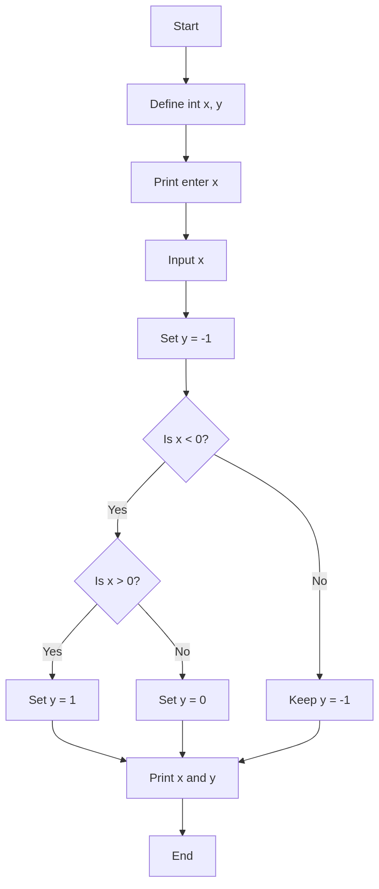
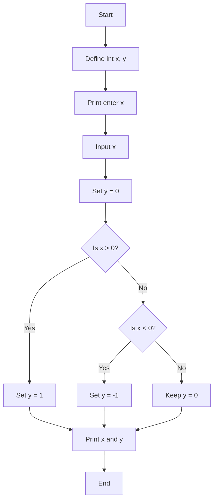

# Assignment Chapter 4
张理凯 202300101051

6. 
```
#include<stdio.h>

int main(){
    float x, y;
    printf("Enter the value of x: ");
    scanf("%f", &x);

    if(x < 1){
        y = x;
    } else if (x >= 1 && x < 10){
        y = 2 * x - 1;
    }else{
        y = 3 * x - 11;
    }
    printf("y = %.2f\n", y);
    return 0;
}
```
```
$ Enter the value of x: 0.5
y = 0.50
$ Enter the value of x: 5
y = 9.00
$ Enter the value of x: 15
y = 34.00
```

7. 程序1无法正确实现题目中的要求。它首先初始化变量 y = -1, 如果 x < 0，进入第一个if语句。但是接着的条件if(x > 0)永远为假，所以y保持为-1。如果x >= 0，则不会进入第一个if语句，y依然保持为-1。所以无法满足条件。



程序2可以满足题目要求。


11.  
```
#include <stdio.h>

void sort(int *a, int *b, int *c, int *d) {
    int temp;
    if (*a > *b) { temp = *a; *a = *b; *b = temp; }
    if (*b > *c) { temp = *b; *b = *c; *c = temp; }
    if (*c > *d) { temp = *c; *c = *d; *d = temp; }
    if (*a > *b) { temp = *a; *a = *b; *b = temp; }
    if (*b > *c) { temp = *b; *b = *c; *c = temp; }
    if (*a > *b) { temp = *a; *a = *b; *b = temp; }
}

int main() {
    int a, b, c, d;

    printf("Enter 4 numbers: ");
    scanf("%d %d %d %d", &a, &b, &c, &d);

    sort(&a, &b, &c, &d);

    printf("The numbers in ascending order are: %d %d %d %d\n", a, b, c, d);
    return 0;
}
```

```
$ Enter 4 numbers: 5 2 6 9
The numbers in ascending order are: 2 5 6 9
```

12. 
```#include<stdio.h>

int main(){
    float x, y;
    float x1 = 2, y1 = 2, x2 = -2, y2 = 2, x3 = -2, y3 = -2, x4 = 2, y4 = -2;
    float r = 1;
    float h = 0;

    printf("Enter (x, y) respectively: ");
    scanf("%f %f", &x, &y);
    
    if((x - x1) * (x - x1) + (y - y1) * (y - y1) <= r * r){
        h = 10;
    }else{
        h = 0;
}
printf("h = %.2f m\n", h);
}
```

```
$ Enter (x, y) respectively: 1 1
h = 0.00 m
$ Enter (x, y) respectively: 2 2
h = 10.00 m
```